  

☝️ That terminal isn't a screenshot or a widget — it's an SVG my own <a href="./.github/scripts/generate-header.js">generator script</a> renders from the live GitHub API, rebuilt daily by <a href="./.github/workflows/header.yml">a GitHub Action</a>. The stats and the last-pushed repo are always current.

I build AI-powered web products end to end — from the FastAPI agents doing the reasoning
to the Next.js app people actually click on. Most of what's below is deployed and live;
click the demos, they work.

---

## Selected Work

### 🎧 IELTS Practice Hub — an AI examiner for all four IELTS modules
Speaking, Listening, Reading and Writing practice with real exam timers, in-browser audio
recording, and instant AI feedback. The interesting part is the backend: five separate
FastAPI agents (one per module, plus an omni-tutor) hold all the intelligence, so the
frontend stays a thin, fully-typed client with zero AI logic leaking into it.

`Next.js 16` `React 19` `TypeScript` `Tailwind 4` `FastAPI` `Python`
**[Live demo](https://ielts-practice-hub-nine.vercel.app)** · [Frontend](https://github.com/mrmushii/Ielts_practice_hub) · [Backend](https://github.com/mrmushii/Ielts_practice_hub_backend)

### ⚡ AutoGit Pro — a VS Code extension, v1.2.0
Reads your staged diff and writes the commit message for you. Shipped as a real, versioned
extension with a changelog and a packaged release — not a weekend script.

`TypeScript` `VS Code Extension API` `LLM`
[Code](https://github.com/mrmushii/autoGit-pro)

### 🚀 Upscale — career platform (hackathon build)
AI-generated 3-stage learning roadmaps, mock interviews, and a job board that merges internal
recruiter posts with the Findwork.dev API. Built against a hackathon clock and still shipped
with auth, API docs, and a deploy.

`Next.js 14` `TypeScript` `MongoDB Atlas` `Google Gemini`
**[Live demo](https://up-scale-next-gen-hacka-thon-6xhl.vercel.app)** · [Code](https://github.com/mrmushii/upScale_nextGen_hackaThon)

### 🌾 Krishi — real-time advisory for farmers
Gemini-powered crop guidance with a Leaflet map layer and live Socket.IO updates, aimed at
users on low-end phones and patchy connections.

`React` `Vite` `Firebase` `Socket.IO` `Leaflet` `Gemini`
**[Live demo](https://krishi-ten.vercel.app)** · [Code](https://github.com/mrmushii/krishi)

### 🛡️ CodeGuard — exam proctoring browser extension
A Chrome/Edge extension that monitors browsing activity during online exams, packaged and
distributed through GitHub Releases with a versioned build script.

`JavaScript` `Chrome Manifest V3` `React`
[Code](https://github.com/mrmushii/CodeGuardExtension)

### 🛒 Commerze — production-shaped e-commerce
Full storefront with Clerk auth, Stripe checkout and webhooks, Cloudinary uploads, and
Mongoose data models. The boring, necessary stuff done properly.

`Next.js` `TypeScript` `MongoDB` `Stripe` `Clerk` `Cloudinary`
**[Live demo](https://commerze-mu.vercel.app)** · [Code](https://github.com/mrmushii/Commerze)

---

## Stack

**Frontend** — React, Next.js (App Router), TypeScript, Tailwind, GSAP, Three.js / R3F
**Backend** — Node, Express, FastAPI, Django, REST APIs
**Data** — MongoDB / Mongoose, Firebase, MySQL
**AI** — Google Gemini, Groq, Vercel AI SDK, agent architectures
**Tooling** — Git, Docker, Vercel, Stripe, Clerk
**Also** — C++ for DSA and competitive programming

---

## Currently

Building AI agent architectures behind real product surfaces, and getting properly good at
Docker and system design. Open to full-stack internships and open-source collaboration.

  

